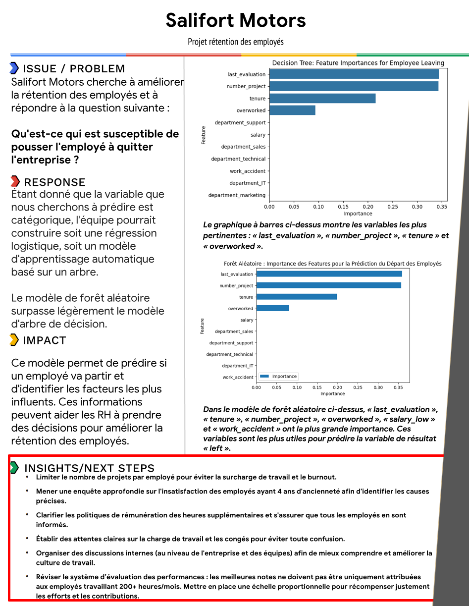

# 🔍 Prédiction du Turnover des Employés avec le Machine Learning  


Ce projet explore les facteurs influençant le départ des employés en entreprise et utilise des modèles de Machine Learning pour prédire le turnover.


---

## 📊 Objectif  
L'objectif est d'aider les entreprises à mieux comprendre les raisons du turnover et à améliorer la rétention des employés grâce à une analyse de données et des modèles prédictifs.

---

## 📝 Données  
- **Dataset utilisé** : HR Employee Attrition Dataset  
- **Source** : Disponible dans le même dossier
- **Variables clés** : Satisfaction au travail, nombre de projets, heures travaillées par mois, ancienneté, salaire, etc.

---

## 🚀 Modèles Testés  
✔ **Régression Logistique**  
✔ **Arbre de Décision**  
✔ **Forêt Aléatoire (Random Forest)**  

---

## 📈 Résultats  
Le modèle **Random Forest** a obtenu un **AUC de 98%**, identifiant les **facteurs clés du départ des employés** :  

🔹 **Surcharge de travail** (trop de projets)  
🔹 **Ancienneté de 4 ans** associée à une baisse de motivation  
🔹 **Évaluation de performance élevée liée à des heures excessives (>200h/mois)**  

---

## 🎯 Recommandations Business  
📌 **Limiter le nombre de projets** par employé pour éviter la surcharge de travail.  
📌 **Étudier pourquoi les employés de 4 ans d'ancienneté** sont insatisfaits.  
📌 **Revoir les politiques de rémunération des heures supplémentaires** et s'assurer que les employés les connaissent.  
📌 **Clarifier les attentes en matière de charge de travail et de congés.**  
📌 **Revoir le système d'évaluation** pour ne pas uniquement récompenser les employés travaillant 200+ heures/mois.  

---

## 📸 Visualisations  
### 🔥 Résultat  
  


---

## 🔧 Installation  

1️⃣ **Cloner le repo** :  
```bash
git clone https://github.com/Yohannkp/Projet-Salifort-Motors..git

```

2 **Installer les dépendances :** :  
```bash
pip install -r requirements.txt

```