# 🔍 Prédiction de l’attrition des employés chez Salifort Motors

Projet de data science visant à prédire les départs d’employés dans une grande entreprise de conseil, à partir de données RH internes. Ce projet a été réalisé dans le cadre du capstone final du programme Data Analyst (IBM x Coursera).

---

## 🎯 Objectif

Le département RH souhaite comprendre pourquoi certains employés quittent l’entreprise et agir de manière préventive.  
Mes objectifs étaient :

- D’**analyser** les données collectées
- D’**identifier** les facteurs déterminants du départ
- De **construire un modèle prédictif fiable**
- Et de formuler **des recommandations concrètes**

---
## 📊 Dashboard  
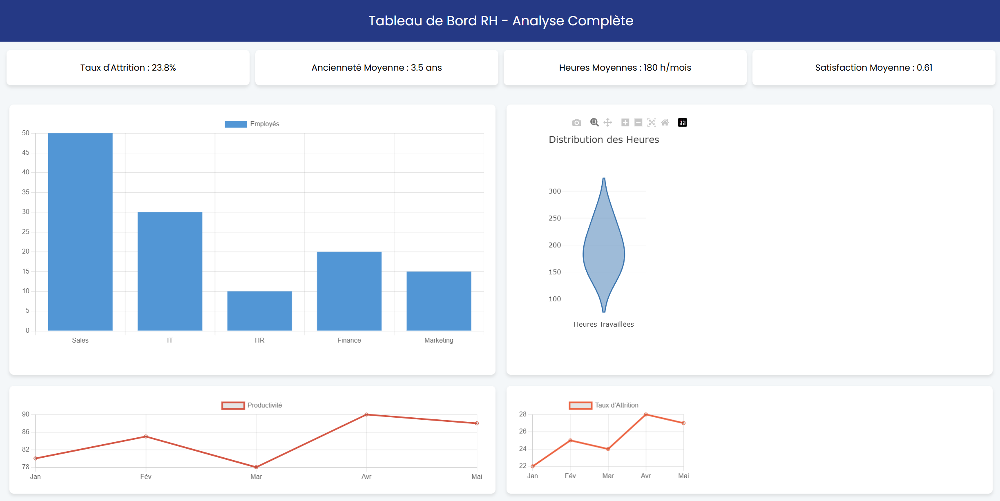 
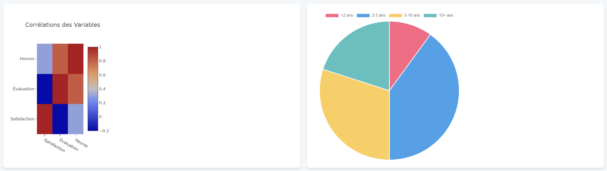 

---
Lien du Dashboard : https://dashboard-pr-diction-du-turnover-des.onrender.com/

Lien de l'API : https://projet-salifort-motors-production.up.railway.app

Lien de l'application :https://projet-salifort-motors-app.streamlit.app/ 

---

## 📊 Données utilisées

- Données internes anonymisées de 14 999 employés
- 10 variables initiales :
  - Taux de satisfaction
  - Évaluation annuelle
  - Nombre de projets
  - Heures de travail mensuelles
  - Ancienneté (`tenure`)
  - Accident de travail
  - Promotion (5 dernières années)
  - Département
  - Niveau de salaire
  - État de départ (`left`)

🔧 **Prétraitement :**
- Nettoyage des doublons (20%)
- Normalisation des noms de colonnes
- Encodage (`salary` ordinal, `department` one-hot)
- Suppression des outliers sur `tenure`
- Création d’une nouvelle variable `overworked` (> 175 h/mois)

---

## 🧪 Modèles construits

### Modélisation supervisée :

| Modèle                    | Données complètes (v1) | Données sans satisfaction (v2) |
|---------------------------|------------------------|---------------------------------|
| Régression logistique     | ✅                     | ❌                              |
| Arbre de décision         | ✅                     | ✅                              |
| Forêt aléatoire           | ✅                     | ✅                              |

---

## 📈 Résultats

### 🔎 Résumé des performances sur jeu de test :

| Modèle                   | Précision | Rappel | F1-score | Accuracy | AUC     |
|--------------------------|-----------|--------|----------|----------|---------|
| Régression logistique    | 0.80      | 0.83   | 0.80     | 0.83     | 0.84    |
| Arbre de décision (v2)   | 0.87      | 0.90   | 0.89     | 0.96     | 0.94    |
| Forêt aléatoire (v2)     | **0.87**  | **0.90** | **0.89** | **0.96** | **0.94** |

✅ Le modèle final est une **forêt aléatoire** entraînée sur des données sans fuite potentielle (`satisfaction_level` exclu). Il est **robuste, fiable et généralisable**.

---

## 🖼️ Illustrations

### 📊 Analyse exploratoire

- **Distribution des départs par satisfaction**  
  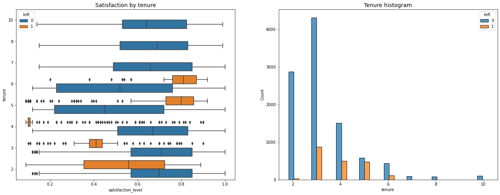

- **Boxplot : heures travaillées vs nombre de projets**  
  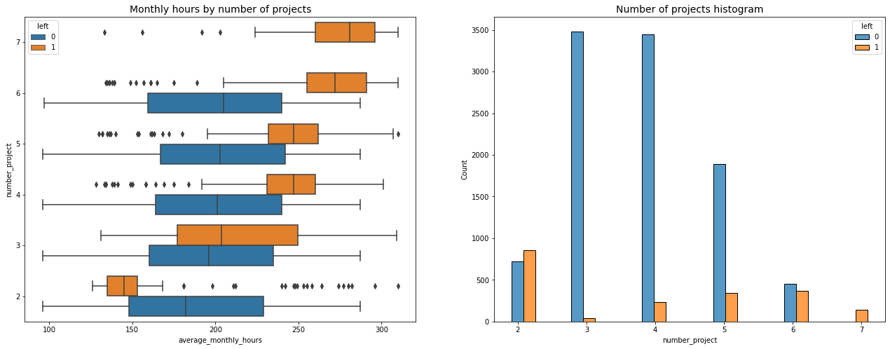

- **Heures mensuelles vs évaluation annuelle**  
  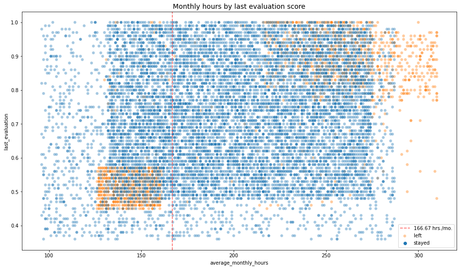

- **Tenure vs Salary**  
  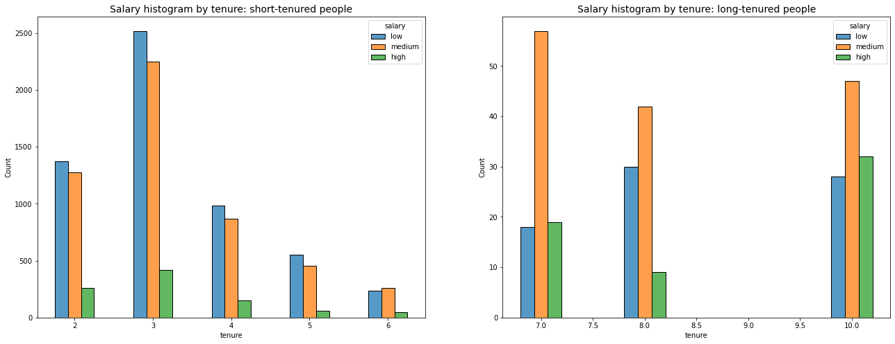

---

### 🌳 Visualisation des modèles

- **Matrice de confusion – Random Forest v2**  
  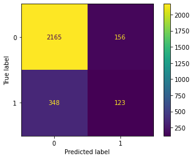

- **Arbre de décision simplifié (splits)**  
  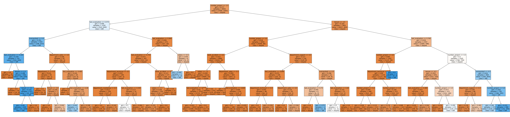

- **Importance des variables – Arbre de décision**  
  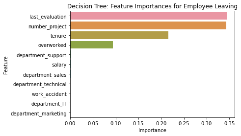

- **Importance des variables – Forêt aléatoire**  
  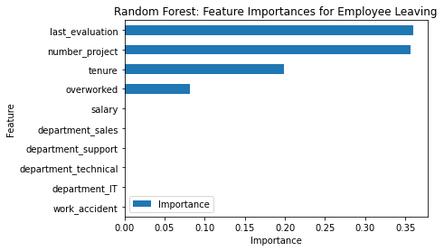

---

## 💡 Recommandations métier

1. **Limiter la surcharge de travail**
   - Réduire les heures > 200/mois
   - Éviter > 5 projets actifs par employé
2. **Valoriser les anciens**
   - Prime/promotion après 4 ans d’ancienneté
3. **Récompenser l’effort**
   - Système d’évaluation plus équitable, non basé uniquement sur la charge
4. **Clarifier les règles RH**
   - Heures supplémentaires, reconnaissance, congés
5. **Renforcer la culture d’entreprise**
   - Ateliers, sondages, feedback anonymes

---

## 🧠 Interprétabilité & éthique

- Le modèle utilise des données disponibles en interne
- La variable `overworked` a été introduite pour limiter la dépendance à des variables sensibles (`satisfaction`)
- Pas de donnée personnelle, pas de décision automatisée : l'outil est **décisionnel**, pas **exécutif**

---

### 🔥 Résumé  
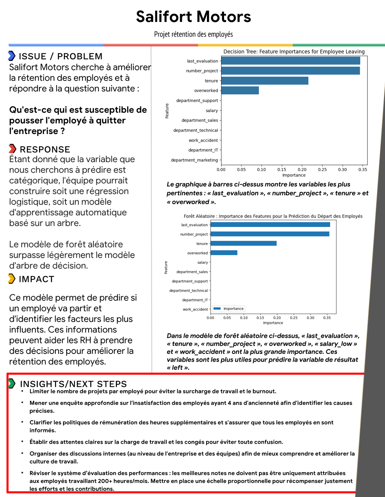  

---
## 📌 Ressources

- [Scikit-learn](https://scikit-learn.org/)
- [XGBoost](https://xgboost.readthedocs.io/)
- [Seaborn](https://seaborn.pydata.org/)
- [Coursera IBM Data Analyst Capstone](https://www.coursera.org/)

---

## 👨‍💻 Auteur

**Yendi Yohann**  
📧 [yendiyohann@gmail.com]  
📍 Projet réalisé dans le cadre du certificat IBM Data Analyst — Coursera

---